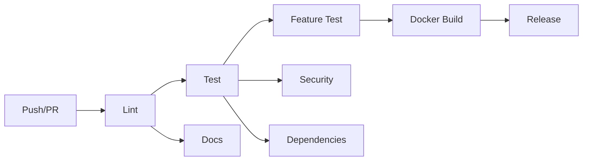

# 🔄 CI/CD Integration Guide

This document explains how Virtuoso Architect integrates with CI/CD pipelines.

---

## 📋 Overview

The project uses **GitHub Actions** for automated testing, linting, security scanning, and deployment.

---

## 🚀 CI/CD Pipeline

### Pipeline Stages



### Jobs Overview

| Job | Purpose | Runs On |
|-----|---------|---------|
| **Lint** | Code quality (Black, Flake8, Pylint) | Every push/PR |
| **Test** | Unit tests + coverage | Every push/PR |
| **Feature Test** | Test MIDI feature extraction | Every push/PR |
| **Docs** | Validate documentation links | Every push/PR |
| **Security** | Security scan (Bandit) | Every push/PR |
| **Dependencies** | Check for vulnerabilities (Safety) | Every push/PR |
| **Docker** | Build Docker image | Main branch only |
| **Release** | Create GitHub release | Tags only |

---

## 🔧 Setup Instructions

### 1. Enable GitHub Actions

GitHub Actions is enabled by default. The workflow file is at:
```
.github/workflows/ci.yml
```

### 2. Add Secrets (Optional)

For advanced features, add these secrets in GitHub Settings → Secrets:

- `CODECOV_TOKEN` - For code coverage reports
- `DOCKER_USERNAME` - For Docker Hub
- `DOCKER_PASSWORD` - For Docker Hub

### 3. Configure Branch Protection

**Recommended settings for `main` branch:**

1. Go to Settings → Branches → Branch protection rules
2. Add rule for `main`
3. Enable:
   - ✅ Require status checks to pass
   - ✅ Require branches to be up to date
   - ✅ Require linear history
   - ✅ Include administrators

**Required status checks:**
- `lint`
- `test`
- `feature-test`

---

## 📊 Workflow Details

### Linting (Code Quality)

**Tools used:**
- **Black** - Code formatter
- **Flake8** - Style guide enforcement
- **Pylint** - Static code analysis

**Run locally:**
```bash
# Format code
black src/ scripts/

# Check style
flake8 src/ scripts/ --max-line-length=100

# Run pylint
pylint src/
```

### Testing

**Framework:** pytest

**Run locally:**
```bash
# Install test dependencies
pip install pytest pytest-cov

# Run tests
pytest tests/ --cov=src

# Generate HTML coverage report
pytest tests/ --cov=src --cov-report=html
```

### Feature Extraction Test

Tests the core MIDI analysis functionality with a sample file.

**Run locally:**
```bash
python scripts/test_features.py
```

### Security Scanning

**Tool:** Bandit

**Run locally:**
```bash
pip install bandit
bandit -r src/ -f json -o bandit-report.json
```

### Dependency Vulnerability Check

**Tool:** Safety

**Run locally:**
```bash
pip install safety
safety check --file requirements.txt
```

---

## 🐳 Docker Integration

### Build Docker Image

```bash
docker build -t virtuoso-architect:latest .
```

### Run Container

```bash
# Analyze a MIDI file
docker run -v /path/to/midi:/data virtuoso-architect:latest \
  python src/main.py --midi_file /data/file.mid

# Interactive shell
docker run -it virtuoso-architect:latest /bin/bash
```

### Push to Docker Hub

```bash
docker tag virtuoso-architect:latest username/virtuoso-architect:latest
docker push username/virtuoso-architect:latest
```

---

## 📦 Release Process

### Creating a Release

1. **Update version** in code (if applicable)
2. **Commit changes**
3. **Create and push tag:**

```bash
git tag -a v1.0.0 -m "Release version 1.0.0"
git push origin v1.0.0
```

4. **GitHub Actions automatically:**
   - Runs all tests
   - Creates GitHub release
   - Attaches artifacts

### Semantic Versioning

Follow [SemVer](https://semver.org/):

- `v1.0.0` - Major release (breaking changes)
- `v1.1.0` - Minor release (new features)
- `v1.0.1` - Patch release (bug fixes)

---

## 🔍 Monitoring CI/CD

### View Workflow Runs

1. Go to **Actions** tab on GitHub
2. Click on a workflow run
3. View logs for each job

### Badges

Add status badges to README:

```markdown


```

---

## 🛠️ Customization

### Modify Workflow

Edit `.github/workflows/ci.yml` to:

- Add new jobs
- Change Python versions
- Modify test commands
- Add deployment steps

### Add Pre-commit Hooks

Install pre-commit for local checks:

```bash
pip install pre-commit
pre-commit install
```

Create `.pre-commit-config.yaml`:

```yaml
repos:
  - repo: https://github.com/psf/black
    rev: 23.1.0
    hooks:
      - id: black
  
  - repo: https://github.com/PyCQA/flake8
    rev: 6.0.0
    hooks:
      - id: flake8
```

---

## 🚨 Troubleshooting

### CI Fails on Lint

**Fix:**
```bash
black src/ scripts/
git add .
git commit -m "Fix code formatting"
git push
```

### Tests Fail

**Debug locally:**
```bash
pytest tests/ -v --tb=short
```

### Docker Build Fails

**Check:**
- Dockerfile syntax
- Dependencies in requirements.txt
- File paths

---

## 📈 Best Practices

### 1. Write Tests First

- Add tests for new features
- Aim for >80% code coverage
- Test edge cases

### 2. Keep CI Fast

- Use caching for dependencies
- Run expensive tests only on main branch
- Parallelize jobs when possible

### 3. Monitor Failures

- Fix broken builds immediately
- Don't merge failing PRs
- Review security scan results

### 4. Document Changes

- Update CHANGELOG.md
- Add migration guides for breaking changes
- Keep README up to date

---

## 🔗 Resources

- [GitHub Actions Documentation](https://docs.github.com/en/actions)
- [Docker Best Practices](https://docs.docker.com/develop/dev-best-practices/)
- [Python Testing Best Practices](https://docs.pytest.org/en/stable/goodpractices.html)

---

## 📝 Example Workflows

### Continuous Deployment to Cloud

Add to `.github/workflows/cd.yml`:

```yaml
name: Deploy to Cloud

on:
  push:
    branches: [ main ]

jobs:
  deploy:
    runs-on: ubuntu-latest
    steps:
      - uses: actions/checkout@v3
      
      - name: Deploy to Heroku
        uses: akhileshns/heroku-deploy@v3.12.12
        with:
          heroku_api_key: ${{secrets.HEROKU_API_KEY}}
          heroku_app_name: "virtuoso-architect"
          heroku_email: "your-email@example.com"
```

### Scheduled Model Retraining

```yaml
name: Retrain Model

on:
  schedule:
    - cron: '0 0 * * 0'  # Weekly on Sunday

jobs:
  retrain:
    runs-on: ubuntu-latest
    steps:
      - uses: actions/checkout@v3
      
      - name: Retrain model
        run: |
          python scripts/quick_start_all_files.py
```

---

**CI/CD makes your project production-ready!** 🚀
